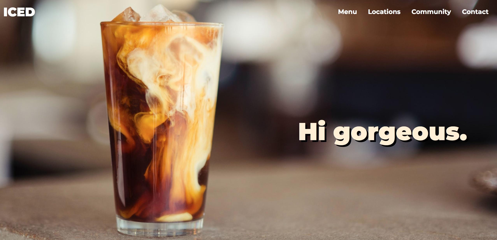

# ICED - the cafe for iced coffee addicts.
Simple, fun business website with HTML, SASS, Bootstrap and TypeScript.

## Table of contents

- [Overview](#overview)
  - [Screenshot](#screenshot)
  - [Links](#links)
- [My process](#my-process)
  - [Built with](#built-with)
  - [What I learned](#what-i-learned)
  - [Continued development](#continued-development)
  - [Useful resources](#useful-resources)
- [Author](#author)

## Overview

### Screenshot

### Links

- Live Site URL: [Add live site URL here](https://your-live-site-url.com)

### Built with

- Semantic HTML5 markup
- CSS
- SASS
- Flexbox
- JavaScript
- Bootstrap
- Mobile-first workflow

### What I learned
During this project I got to develop some more layout and styling skills using Flexbox and SASS. I practiced creating modals from scratch and also learned more about using Bootstrap's navbar component.

### Continued development

### Useful resources

## Author

- GitHub - [malin-nilsson](https://github.com/malin-nilsson)

## Acknowledgments
Iced coffee 💙
